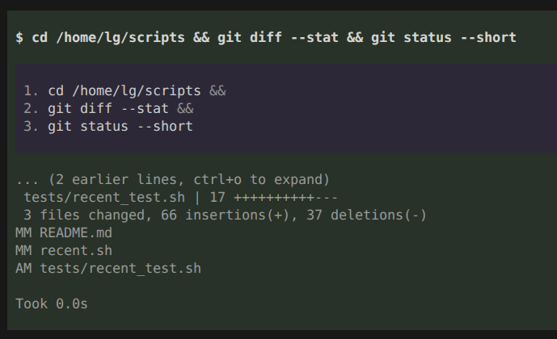

# Pi Parse Commands

[](https://www.npmjs.com/package/@lglen/pi-parse-commands)
[](https://www.npmjs.com/package/@lglen/pi-parse-commands)
[](https://github.com/LaishGlenberg/pi-parse-commands/actions)

A pi coding agent extension that lists every command in a chained bash tool call.



## Problem

Agents often emit dense one-liners like:

```bash
cd /repo && rg -c "foo" out.json; rg -c "bar" out.json; rg -c "baz" out.json && node -e "..."
```

The default renderer prints that as a single long line, so it is hard to tell which commands actually ran. This extension keeps the normal command line and adds a nested box below it with one line per command:

```
$ cd /repo && rg -c "foo" out.json; rg -c "bar" out.json; rg -c "baz" out.json && node -e "..."

  1. cd /repo &&
  2. rg -c "foo" out.json ;
  3. rg -c "bar" out.json ;
  4. rg -c "baz" out.json &&
  5. node -e "..."
```

The breakdown box uses a slightly different background color so it reads as an inset annotation rather than tool output. Configured command names are highlighted in the breakdown and command line.

## What it splits on

By default the breakdown splits on the main command-list operators plus newlines:

- `&&`, `||`, `;`, and newlines

The pipe and background operators are opt-in through the `separators` config:

- `|&`, `|`, `&`

It does **not** split inside:

- single quotes (`'a && b'`)
- double quotes (`"a; b"`)
- escaped separators (`a\;b`)
- comments (`echo a # not; a; command`)
- redirections (`2>&1`, `>&2`, `&>file`)

Command substitution `$(...)`, here-documents, and `case` statements are parsed naively: separators inside them are treated as command boundaries. This is usually fine for a quick overview.

## Installation

Install from npm with pi:

```bash
pi install npm:@lglen/pi-parse-commands
```

Or straight from GitHub:

```bash
pi install git:github.com/LaishGlenberg/pi-parse-commands
```

Pi loads `index.ts` through the package manifest in `package.json`.

## Command highlighting

Create a config directory at `~/.pi/agent/extensions/pi-parse-commands-config/` and add one of
`config.jsonc`, `config.json`, `config.yaml`, or `config.yml` (the first file found is
used). JSONC supports comments and trailing commas:

```jsonc
{
  // 0 = green, 1 = yellow, 2 = orange, 3 = red
  "commands": {
    "node": 1,
    "rm": 3,
    "rg": 2
  },
  // List operators that start a new breakdown line.
  // Defaults to the three below; add any of "|&", "|", "&" to opt in.
  "separators": ["&&", "||", ";"]
}
```

The YAML equivalent is:

```yaml
commands:
  node: 1
  rm: 3
  rg: 2
separators: ["&&", "||", ";"]
```

## Behavior

The extension overrides only the rendering of the built-in `bash` tool. Execution, output truncation, timing, and the expanded result view are unchanged.

## Development

Requirements: Node.js 22.19 or newer and npm.

```bash
npm install
npm test
npm run typecheck
npm run lint
```

See [docs/development.md](docs/development.md) for parser details, test strategy, and release steps.

## Changelog

See [CHANGELOG.md](CHANGELOG.md).

## License

[MIT](LICENSE).
