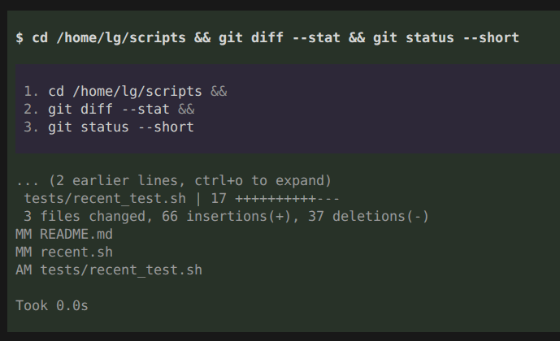

# Pi Parse Commands

[](https://www.npmjs.com/package/@lglen/pi-parse-commands)
[](https://www.npmjs.com/package/@lglen/pi-parse-commands)
[](https://github.com/LaishGlenberg/pi-parse-commands/actions)

A pi coding agent extension that lists every command in a chained bash tool call.



## Problem

Agents often emit dense one-liners like:

```bash
cd /repo && rg -c "foo" out.json; rg -c "bar" out.json; rg -c "baz" out.json && node -e "..."
```

The default renderer prints that as a single long line, so it is hard to tell which commands actually ran. This extension keeps the normal command line and adds a nested box below it with one line per command:

```
$ cd /repo && rg -c "foo" out.json; rg -c "bar" out.json; rg -c "baz" out.json && node -e "..."

  1. cd /repo &&
  2. rg -c "foo" out.json ;
  3. rg -c "bar" out.json ;
  4. rg -c "baz" out.json &&
  5. node -e "..."
```

The breakdown box uses a slightly different background color so it reads as an inset annotation rather than tool output. Configured command names are highlighted in the breakdown and command line.

## What it splits on

By default the breakdown splits on the main command-list operators plus newlines:

- `&&`, `||`, `;`, and newlines

The pipe and background operators are opt-in through the `separators` config:

- `|&`, `|`, `&`

It does **not** split inside:

- single quotes (`'a && b'`)
- double quotes (`"a; b"`)
- escaped separators (`a\;b`)
- comments (`echo a # not; a; command`)
- redirections (`2>&1`, `>&2`, `&>file`)

Here-documents are recognized, so an embedded Python, Node, or bash program is
not split into one bogus command per line. The body up to the terminator stays
part of the command that opened it, and a multi-line segment is collapsed in the
box to its first line plus a `… (+N lines)` marker so the body is not reprinted.

Command substitution `$(...)` and `case` statements are parsed naively:
separators inside them are treated as command boundaries. This is usually fine
for a quick overview.

## Installation

Install from npm with pi:

```bash
pi install npm:@lglen/pi-parse-commands
```

Or straight from GitHub:

```bash
pi install git:github.com/LaishGlenberg/pi-parse-commands
```

Pi loads `index.ts` through the package manifest in `package.json`.

## Command highlighting

Create a config directory at `~/.pi/agent/extensions/pi-parse-commands-config/` and add one of
`config.jsonc`, `config.json`, `config.yaml`, or `config.yml` (the first file found is
used). JSONC supports comments and trailing commas:

```jsonc
{
  // 0 = green, 1 = yellow, 2 = orange, 3 = red
  "commands": {
    "node": 1,
    "rm": 3,
    "rg": 2
  },
  // List operators that start a new breakdown line.
  // Defaults to the three below; add any of "|&", "|", "&" to opt in.
  "separators": ["&&", "||", ";"]
}
```

The YAML equivalent is:

```yaml
commands:
  node: 1
  rm: 3
  rg: 2
separators: ["&&", "||", ";"]
```

When a newer version adds a top-level option, run `/parse-commands config` to bring an existing
config up to date: it inserts the missing option with its default (keeping comments) and
writes a `.bak` backup first. Nothing is migrated or written automatically on load; a
malformed config is left untouched unless you confirm the regenerate prompt.

## Slash commands

Run `/parse-commands` in the TUI to control the extension at runtime:

| Command | Effect |
| --- | --- |
| `/parse-commands on` | Enable the command breakdown for this session |
| `/parse-commands off` | Disable it for this session and restore the built-in command line |
| `/parse-commands config` | Create, upgrade, or regenerate the config file |

`on`/`off` are **session-scoped**: they flip a runtime flag and reset to `on` the next time
pi starts.

`/parse-commands config` manages the config file from the TUI. With no config it writes the default
template to `config.jsonc`; with a config that predates a newer top-level option it inserts
the option in place (keeping comments) and writes a `.bak` backup; with a current config it
reports it is up to date and offers to regenerate it from the default. A malformed config is
never overwritten unless you confirm that prompt. Changes take effect immediately, and the
command is TUI-only. The command completes `on`, `off`, and `config` as you type.

## Behavior

The extension overrides only the rendering of the built-in `bash` tool. Execution, output truncation, timing, and the expanded result view are unchanged.

## Development

Requirements: Node.js 22.19 or newer and npm.

```bash
npm install
npm test
npm run typecheck
npm run lint
```

See [docs/development.md](docs/development.md) for parser details, test strategy, and release steps.

## Changelog

See [CHANGELOG.md](CHANGELOG.md).

## License

[MIT](LICENSE).
